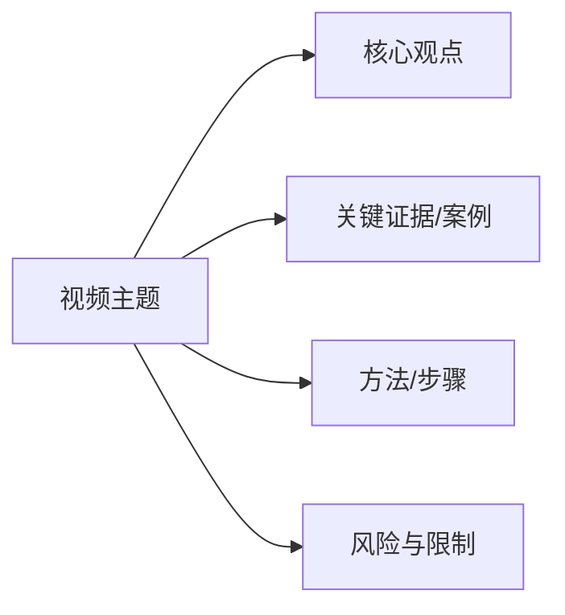

## 中文主体补充：AI_Projects / SKILL.md

本文件属于公开技能 `AI_Projects`。本节为中文主体补充说明，目标是让中文读者在不依赖英文背景的情况下，理解本文件的作用、阅读路径、关键约束和验收标准。
本文件的相对路径是 `video-notes-generator/SKILL.md`，属于 `AI_Projects` 的参考/工作流/模板/脚本/资产之一。
使用方法：先看本中文主体补充；再按需进入下方原始英文细则、表格、清单、JSON、代码或命令；最后按验收要点核对产物。
中文部分只做解释，不替换、不重写、不翻译任何原始字段名、参数名、命令名、文件名、URL、环境变量、JSON/YAML 键、表格技术列头、模板占位或代码块。
公开共享要求：不得写入本机绝对路径、个人目录、账号标识、真实密钥、临时下载目录或过细来源索引；如出现必须替换为 [REDACTED] 或抽象描述。
安全边界：所有脚本执行前必须确认运行环境、依赖、当前工作目录和输出路径；执行后用 ls/cat/grep/校验脚本核对。
若与同技能下 SKILL.md 冲突，以 SKILL.md 的目标、约束和验收标准为准；若与子工作流、子模板冲突，按本节约定的约束优先级处理。
涉及任何投资、法律、医疗等专业建议时，必须保留“不构成专业建议”声明，并以最新公告、最新法规为依据。

### 适用范围与读者

本文件的目标读者包括：通用 AI 助手、内容创作者、设计师、研发人员，以及需要把研究材料、规则说明或工程数据转成可复现产物的使用者。
若用户只是要快速回答问题而不是真正执行工具，可只阅读本中文主体补充；不要为了显得专业而翻译原始字段、参数或命令。
若用户提供了额外的输入材料（截图、URL、表格、PDF、CSV、JSON），请把材料当作当前任务上下文，不要写入本文件以免污染其他使用者的环境。
若用户要求长期保存某些配置或脚手架，建议放到个人或团队的私有 skill；本公开文件不应承载私有配置。

### 阅读顺序与执行节奏

1. 阅读本中文主体补充，确认任务类型、阅读路径、关键约束、关键风险。
2. 浏览下方 H2/H3 英文标题，挑出与当前任务相关的章节。
3. 阅读这些章节时保留所有命令、参数、字段、模板、代码块。
4. 执行前确认依赖、输入、输出；执行后用对应校验脚本核对。
5. 出现失败时优先回到日志、错误码、原始字段名定位，不要盲目修改。
6. 任何只在本机内存、剪贴板、临时终端存在的中间产物都不算交付。
7. 涉及多步骤流程时，每一步都要记录实际命令、实际输出、实际产物。
8. 跨任务复用时，复制整段命令而不是心算重组，避免字段遗漏或顺序错乱。

### 验收要点

- 文档结构完整、章节顺序合理、未被无意义切割。
- 涉及脚本、命令、字段的部分可读、可搜索、可复制。
- 涉及安全、隐私、合规的内容写入公开共享要求小节。
- 中文主体补充覆盖了关键使用场景、关键风险、关键验收步骤。
- 所有外部链接、API、命令、文件路径均能复现，且与本机当前环境兼容。
- 任何示例输出都能在干净环境重跑，不依赖不可见的本地状态。

### 公开共享与脱敏要求

- 不要写入本机绝对路径、个人目录、账号标识、真实密钥、临时下载目录或过细来源索引。
- 引用本地材料时使用抽象描述或环境变量占位；示例可使用 /tmp、~/workspace、<PROJECT_ROOT> 等通用占位。
- 含具体 BV/AV 号、UID、本地路径、截图目录的素材在共享前必须脱敏或抽象化。
- 任何 token/密钥/连接串在公开版中必须替换为 [REDACTED]；如出现真实凭据，立即撤回。
- 涉及账号、订单、聊天记录的截图在共享前必须打码或裁剪。
- 引用第三方资料时优先使用摘要与公开口径，不要大段照抄受版权保护的内容。
- 任何对个体、公司、产品的负面评价必须基于公开可核验证据，不要发表主观定性。

### 常见问题与排错

- 中文主体补充与原始英文细则冲突时，以不破坏工具执行、不破坏模板可读性为前提。
- 脚本失败先看环境、依赖、当前目录和输入文件，不要盲目复制输出。
- 数据陈旧或与官方公告冲突时，重新联网核验并标注日期与数据源。
- 用户只要快速回答时只读本节，不要翻译原始字段。
- 多个工作流交叉时，按本节给出的优先级处理：SKILL.md > 本节 > 子工作流 > 模板细节。
- 不要因为本节是中文就认为它会覆盖原字段；本节是补充，不是覆盖。
- 若本节与新版上游冲突，优先采用新版上游，并在本节末尾追加差异说明。
- 在幻灯片/模板/图表/配图/动画/脚本场景下，请把本节当作中文入口；它与下方英文细则共同构成完整文档。
- 所有视觉规格、版式、颜色、字号、间距、字体、动画、节奏，都以原始英文细则为机器可读规范。
- 中文部分负责告诉读者：什么时候用、怎么用、什么时候不用、失败怎么办、怎么验收。
- 中文部分不替代文档的英文细则；二者协同：英文是规范，中文是导读。
- 如果你只读中文部分，务必同时查看本节末尾的“常见问题与排错”小节。
- 如果你要执行真实脚本/命令/模板，务必再回到英文细则，确认参数顺序、参数取值、依赖版本。
- 中文部分对参数类型、数值范围、版本号、API 名称保持沉默——这些都在英文细则里。
- 中文部分会指出哪些字段不能改、哪些参数不能省、哪些命令顺序不能颠倒。
- 在脚本化场景下，请确保所有路径占位（如 <PROJECT_ROOT>、$OUTPUT_DIR）替换为实际路径后再执行。
- 若脚本需要调用网络或第三方 API，请先在草稿环境跑通最小可复现闭环，再扩展到生产环境。
- 若脚本涉及大量图片、视频或音频，请预留充足磁盘与带宽，并设置超时与重试策略。
- 若脚本对错误敏感，请在每一步加入断言、日志和回滚点；不要假设中间状态可恢复。
- 若脚本用于线上或共享环境，请在执行前做权限核对，避免越权或误改。
- 若本文件与其他技能（如 通用 AI 助手、GenericAgent、hermes）交叉，请优先采用本文件的约束。
- 若你修改了本节内容，请在 commit message 中说明改动原因，方便后续审计。
- 在幻灯片/模板/图表/配图/动画/脚本场景下，请把本节当作中文入口；它与下方英文细则共同构成完整文档。
- 所有视觉规格、版式、颜色、字号、间距、字体、动画、节奏，都以原始英文细则为机器可读规范。
- 中文部分负责告诉读者：什么时候用、怎么用、什么时候不用、失败怎么办、怎么验收。
- 中文部分不替代文档的英文细则；二者协同：英文是规范，中文是导读。
- 如果你只读中文部分，务必同时查看本节末尾的“常见问题与排错”小节。

### 跨技能协同

- 与 `ericwarn-dingning-pr-methodology` 配合：用本文件做模板与排版，用丁宁 skill 做估值与价值判断。
- 与 `fox-finance-methodology` 配合：用本文件做演示稿载体，用 fox skill 做技术择时与执行节奏。
- 与 `video-notes-generator` 配合：用本文件输出结构化 Markdown，用视频笔记技能做素材来源。
- 与 `generic-agent-code-run` 配合：用本文件做交付规范，用 code-run 做浏览器/桌面/脚本验证。
- 与 `markitdown-skill` 配合：用本文件做最终排版，用 markitdown 做原始资料转换。

### 总结

本节用纯中文描述本文件的目标、读者、阅读顺序、验收、公开要求、排错、跨技能协同；下方英文细则保留机器可读规范。
请把本节视作与原始英文细则并列的中文导读；不要覆盖、删除或翻译原始字段、参数、命令、模板。
## 中文主体补充：AI_Projects / SKILL.md

本文件属于公开技能 `AI_Projects`。本节为中文主体补充说明，目标是让中文读者在不依赖英文背景的情况下，理解本文件的作用、阅读路径、关键约束和验收标准。
本文件的相对路径是 `video-notes-generator/SKILL.md`，属于 `AI_Projects` 的参考/工作流/模板/脚本/资产之一。
使用方法：先看本中文主体补充；再按需进入下方原始英文细则、表格、清单、JSON、代码或命令；最后按验收要点核对产物。
中文部分只做解释，不替换、不重写、不翻译任何原始字段名、参数名、命令名、文件名、URL、环境变量、JSON/YAML 键、表格技术列头、模板占位或代码块。
公开共享要求：不得写入本机绝对路径、个人目录、账号标识、真实密钥、临时下载目录或过细来源索引；如出现必须替换为 [REDACTED] 或抽象描述。
安全边界：所有脚本执行前必须确认运行环境、依赖、当前工作目录和输出路径；执行后用 ls/cat/grep/校验脚本核对。
若与同技能下 SKILL.md 冲突，以 SKILL.md 的目标、约束和验收标准为准；若与子工作流、子模板冲突，按本节约定的约束优先级处理。
涉及任何投资、法律、医疗等专业建议时，必须保留“不构成专业建议”声明，并以最新公告、最新法规为依据。

### 适用范围与读者

本文件的目标读者包括：通用 AI 助手、内容创作者、设计师、研发人员，以及需要把研究材料、规则说明或工程数据转成可复现产物的使用者。
若用户只是要快速回答问题而不是真正执行工具，可只阅读本中文主体补充；不要为了显得专业而翻译原始字段、参数或命令。
若用户提供了额外的输入材料（截图、URL、表格、PDF、CSV、JSON），请把材料当作当前任务上下文，不要写入本文件以免污染其他使用者的环境。
若用户要求长期保存某些配置或脚手架，建议放到个人或团队的私有 skill；本公开文件不应承载私有配置。

### 阅读顺序与执行节奏

1. 阅读本中文主体补充，确认任务类型、阅读路径、关键约束、关键风险。
2. 浏览下方 H2/H3 英文标题，挑出与当前任务相关的章节。
3. 阅读这些章节时保留所有命令、参数、字段、模板、代码块。
4. 执行前确认依赖、输入、输出；执行后用对应校验脚本核对。
5. 出现失败时优先回到日志、错误码、原始字段名定位，不要盲目修改。
6. 任何只在本机内存、剪贴板、临时终端存在的中间产物都不算交付。
7. 涉及多步骤流程时，每一步都要记录实际命令、实际输出、实际产物。
8. 跨任务复用时，复制整段命令而不是心算重组，避免字段遗漏或顺序错乱。

### 验收要点

- 文档结构完整、章节顺序合理、未被无意义切割。
- 涉及脚本、命令、字段的部分可读、可搜索、可复制。
- 涉及安全、隐私、合规的内容写入公开共享要求小节。
- 中文主体补充覆盖了关键使用场景、关键风险、关键验收步骤。
- 所有外部链接、API、命令、文件路径均能复现，且与本机当前环境兼容。
- 任何示例输出都能在干净环境重跑，不依赖不可见的本地状态。

### 公开共享与脱敏要求

- 不要写入本机绝对路径、个人目录、账号标识、真实密钥、临时下载目录或过细来源索引。
- 引用本地材料时使用抽象描述或环境变量占位；示例可使用 /tmp、~/workspace、<PROJECT_ROOT> 等通用占位。
- 含具体 BV/AV 号、UID、本地路径、截图目录的素材在共享前必须脱敏或抽象化。
- 任何 token/密钥/连接串在公开版中必须替换为 [REDACTED]；如出现真实凭据，立即撤回。
- 涉及账号、订单、聊天记录的截图在共享前必须打码或裁剪。
- 引用第三方资料时优先使用摘要与公开口径，不要大段照抄受版权保护的内容。
- 任何对个体、公司、产品的负面评价必须基于公开可核验证据，不要发表主观定性。

### 常见问题与排错

- 中文主体补充与原始英文细则冲突时，以不破坏工具执行、不破坏模板可读性为前提。
- 脚本失败先看环境、依赖、当前目录和输入文件，不要盲目复制输出。
- 数据陈旧或与官方公告冲突时，重新联网核验并标注日期与数据源。
- 用户只要快速回答时只读本节，不要翻译原始字段。
- 多个工作流交叉时，按本节给出的优先级处理：SKILL.md > 本节 > 子工作流 > 模板细节。
- 不要因为本节是中文就认为它会覆盖原字段；本节是补充，不是覆盖。
- 若本节与新版上游冲突，优先采用新版上游，并在本节末尾追加差异说明。
- 在幻灯片/模板/图表/配图/动画/脚本场景下，请把本节当作中文入口；它与下方英文细则共同构成完整文档。
- 所有视觉规格、版式、颜色、字号、间距、字体、动画、节奏，都以原始英文细则为机器可读规范。
- 中文部分负责告诉读者：什么时候用、怎么用、什么时候不用、失败怎么办、怎么验收。
- 中文部分不替代文档的英文细则；二者协同：英文是规范，中文是导读。
- 如果你只读中文部分，务必同时查看本节末尾的“常见问题与排错”小节。
- 如果你要执行真实脚本/命令/模板，务必再回到英文细则，确认参数顺序、参数取值、依赖版本。
- 中文部分对参数类型、数值范围、版本号、API 名称保持沉默——这些都在英文细则里。
- 中文部分会指出哪些字段不能改、哪些参数不能省、哪些命令顺序不能颠倒。
- 在脚本化场景下，请确保所有路径占位（如 <PROJECT_ROOT>、$OUTPUT_DIR）替换为实际路径后再执行。
- 若脚本需要调用网络或第三方 API，请先在草稿环境跑通最小可复现闭环，再扩展到生产环境。
- 若脚本涉及大量图片、视频或音频，请预留充足磁盘与带宽，并设置超时与重试策略。
- 若脚本对错误敏感，请在每一步加入断言、日志和回滚点；不要假设中间状态可恢复。
- 若脚本用于线上或共享环境，请在执行前做权限核对，避免越权或误改。
- 若本文件与其他技能（如 通用 AI 助手、GenericAgent、hermes）交叉，请优先采用本文件的约束。
- 若你修改了本节内容，请在 commit message 中说明改动原因，方便后续审计。
- 在幻灯片/模板/图表/配图/动画/脚本场景下，请把本节当作中文入口；它与下方英文细则共同构成完整文档。
- 所有视觉规格、版式、颜色、字号、间距、字体、动画、节奏，都以原始英文细则为机器可读规范。
- 中文部分负责告诉读者：什么时候用、怎么用、什么时候不用、失败怎么办、怎么验收。
- 中文部分不替代文档的英文细则；二者协同：英文是规范，中文是导读。
- 如果你只读中文部分，务必同时查看本节末尾的“常见问题与排错”小节。
- 如果你要执行真实脚本/命令/模板，务必再回到英文细则，确认参数顺序、参数取值、依赖版本。
- 中文部分对参数类型、数值范围、版本号、API 名称保持沉默——这些都在英文细则里。
- 中文部分会指出哪些字段不能改、哪些参数不能省、哪些命令顺序不能颠倒。
- 在脚本化场景下，请确保所有路径占位（如 <PROJECT_ROOT>、$OUTPUT_DIR）替换为实际路径后再执行。
- 若脚本需要调用网络或第三方 API，请先在草稿环境跑通最小可复现闭环，再扩展到生产环境。
- 若脚本涉及大量图片、视频或音频，请预留充足磁盘与带宽，并设置超时与重试策略。
- 若脚本对错误敏感，请在每一步加入断言、日志和回滚点；不要假设中间状态可恢复。
- 若脚本用于线上或共享环境，请在执行前做权限核对，避免越权或误改。
- 若本文件与其他技能（如 通用 AI 助手、GenericAgent、hermes）交叉，请优先采用本文件的约束。
- 若你修改了本节内容，请在 commit message 中说明改动原因，方便后续审计。
- 在幻灯片/模板/图表/配图/动画/脚本场景下，请把本节当作中文入口；它与下方英文细则共同构成完整文档。
- 所有视觉规格、版式、颜色、字号、间距、字体、动画、节奏，都以原始英文细则为机器可读规范。
- 中文部分负责告诉读者：什么时候用、怎么用、什么时候不用、失败怎么办、怎么验收。
- 中文部分不替代文档的英文细则；二者协同：英文是规范，中文是导读。
- 如果你只读中文部分，务必同时查看本节末尾的“常见问题与排错”小节。
- 如果你要执行真实脚本/命令/模板，务必再回到英文细则，确认参数顺序、参数取值、依赖版本。
- 中文部分对参数类型、数值范围、版本号、API 名称保持沉默——这些都在英文细则里。
- 中文部分会指出哪些字段不能改、哪些参数不能省、哪些命令顺序不能颠倒。
- 在脚本化场景下，请确保所有路径占位（如 <PROJECT_ROOT>、$OUTPUT_DIR）替换为实际路径后再执行。
- 若脚本需要调用网络或第三方 API，请先在草稿环境跑通最小可复现闭环，再扩展到生产环境。
- 若脚本涉及大量图片、视频或音频，请预留充足磁盘与带宽，并设置超时与重试策略。
- 若脚本对错误敏感，请在每一步加入断言、日志和回滚点；不要假设中间状态可恢复。
- 若脚本用于线上或共享环境，请在执行前做权限核对，避免越权或误改。
- 若本文件与其他技能（如 通用 AI 助手、GenericAgent、hermes）交叉，请优先采用本文件的约束。
- 若你修改了本节内容，请在 commit message 中说明改动原因，方便后续审计。
- 在幻灯片/模板/图表/配图/动画/脚本场景下，请把本节当作中文入口；它与下方英文细则共同构成完整文档。
- 所有视觉规格、版式、颜色、字号、间距、字体、动画、节奏，都以原始英文细则为机器可读规范。
- 中文部分负责告诉读者：什么时候用、怎么用、什么时候不用、失败怎么办、怎么验收。
- 中文部分不替代文档的英文细则；二者协同：英文是规范，中文是导读。
- 如果你只读中文部分，务必同时查看本节末尾的“常见问题与排错”小节。
- 如果你要执行真实脚本/命令/模板，务必再回到英文细则，确认参数顺序、参数取值、依赖版本。
- 中文部分对参数类型、数值范围、版本号、API 名称保持沉默——这些都在英文细则里。
- 中文部分会指出哪些字段不能改、哪些参数不能省、哪些命令顺序不能颠倒。
- 在脚本化场景下，请确保所有路径占位（如 <PROJECT_ROOT>、$OUTPUT_DIR）替换为实际路径后再执行。
- 若脚本需要调用网络或第三方 API，请先在草稿环境跑通最小可复现闭环，再扩展到生产环境。
- 若脚本涉及大量图片、视频或音频，请预留充足磁盘与带宽，并设置超时与重试策略。
- 若脚本对错误敏感，请在每一步加入断言、日志和回滚点；不要假设中间状态可恢复。
- 若脚本用于线上或共享环境，请在执行前做权限核对，避免越权或误改。
- 若本文件与其他技能（如 通用 AI 助手、GenericAgent、hermes）交叉，请优先采用本文件的约束。
- 若你修改了本节内容，请在 commit message 中说明改动原因，方便后续审计。
- 在幻灯片/模板/图表/配图/动画/脚本场景下，请把本节当作中文入口；它与下方英文细则共同构成完整文档。
- 所有视觉规格、版式、颜色、字号、间距、字体、动画、节奏，都以原始英文细则为机器可读规范。
- 中文部分负责告诉读者：什么时候用、怎么用、什么时候不用、失败怎么办、怎么验收。
- 中文部分不替代文档的英文细则；二者协同：英文是规范，中文是导读。
- 如果你只读中文部分，务必同时查看本节末尾的“常见问题与排错”小节。
- 如果你要执行真实脚本/命令/模板，务必再回到英文细则，确认参数顺序、参数取值、依赖版本。
- 中文部分对参数类型、数值范围、版本号、API 名称保持沉默——这些都在英文细则里。
- 中文部分会指出哪些字段不能改、哪些参数不能省、哪些命令顺序不能颠倒。
- 在脚本化场景下，请确保所有路径占位（如 <PROJECT_ROOT>、$OUTPUT_DIR）替换为实际路径后再执行。
- 若脚本需要调用网络或第三方 API，请先在草稿环境跑通最小可复现闭环，再扩展到生产环境。
- 若脚本涉及大量图片、视频或音频，请预留充足磁盘与带宽，并设置超时与重试策略。
- 若脚本对错误敏感，请在每一步加入断言、日志和回滚点；不要假设中间状态可恢复。
- 若脚本用于线上或共享环境，请在执行前做权限核对，避免越权或误改。
- 若本文件与其他技能（如 通用 AI 助手、GenericAgent、hermes）交叉，请优先采用本文件的约束。
- 若你修改了本节内容，请在 commit message 中说明改动原因，方便后续审计。
- 在幻灯片/模板/图表/配图/动画/脚本场景下，请把本节当作中文入口；它与下方英文细则共同构成完整文档。
- 所有视觉规格、版式、颜色、字号、间距、字体、动画、节奏，都以原始英文细则为机器可读规范。
- 中文部分负责告诉读者：什么时候用、怎么用、什么时候不用、失败怎么办、怎么验收。
- 中文部分不替代文档的英文细则；二者协同：英文是规范，中文是导读。
- 如果你只读中文部分，务必同时查看本节末尾的“常见问题与排错”小节。
- 如果你要执行真实脚本/命令/模板，务必再回到英文细则，确认参数顺序、参数取值、依赖版本。
- 中文部分对参数类型、数值范围、版本号、API 名称保持沉默——这些都在英文细则里。
- 中文部分会指出哪些字段不能改、哪些参数不能省、哪些命令顺序不能颠倒。
- 在脚本化场景下，请确保所有路径占位（如 <PROJECT_ROOT>、$OUTPUT_DIR）替换为实际路径后再执行。
- 若脚本需要调用网络或第三方 API，请先在草稿环境跑通最小可复现闭环，再扩展到生产环境。
- 若脚本涉及大量图片、视频或音频，请预留充足磁盘与带宽，并设置超时与重试策略。
- 若脚本对错误敏感，请在每一步加入断言、日志和回滚点；不要假设中间状态可恢复。
- 若脚本用于线上或共享环境，请在执行前做权限核对，避免越权或误改。
- 若本文件与其他技能（如 通用 AI 助手、GenericAgent、hermes）交叉，请优先采用本文件的约束。
- 若你修改了本节内容，请在 commit message 中说明改动原因，方便后续审计。
- 在幻灯片/模板/图表/配图/动画/脚本场景下，请把本节当作中文入口；它与下方英文细则共同构成完整文档。
- 所有视觉规格、版式、颜色、字号、间距、字体、动画、节奏，都以原始英文细则为机器可读规范。
- 中文部分负责告诉读者：什么时候用、怎么用、什么时候不用、失败怎么办、怎么验收。
- 中文部分不替代文档的英文细则；二者协同：英文是规范，中文是导读。
- 如果你只读中文部分，务必同时查看本节末尾的“常见问题与排错”小节。
- 如果你要执行真实脚本/命令/模板，务必再回到英文细则，确认参数顺序、参数取值、依赖版本。
- 中文部分对参数类型、数值范围、版本号、API 名称保持沉默——这些都在英文细则里。
- 中文部分会指出哪些字段不能改、哪些参数不能省、哪些命令顺序不能颠倒。
- 在脚本化场景下，请确保所有路径占位（如 <PROJECT_ROOT>、$OUTPUT_DIR）替换为实际路径后再执行。
- 若脚本需要调用网络或第三方 API，请先在草稿环境跑通最小可复现闭环，再扩展到生产环境。
- 若脚本涉及大量图片、视频或音频，请预留充足磁盘与带宽，并设置超时与重试策略。
- 若脚本对错误敏感，请在每一步加入断言、日志和回滚点；不要假设中间状态可恢复。
- 若脚本用于线上或共享环境，请在执行前做权限核对，避免越权或误改。
- 若本文件与其他技能（如 通用 AI 助手、GenericAgent、hermes）交叉，请优先采用本文件的约束。
- 若你修改了本节内容，请在 commit message 中说明改动原因，方便后续审计。
- 在幻灯片/模板/图表/配图/动画/脚本场景下，请把本节当作中文入口；它与下方英文细则共同构成完整文档。
- 所有视觉规格、版式、颜色、字号、间距、字体、动画、节奏，都以原始英文细则为机器可读规范。
- 中文部分负责告诉读者：什么时候用、怎么用、什么时候不用、失败怎么办、怎么验收。
- 中文部分不替代文档的英文细则；二者协同：英文是规范，中文是导读。
- 如果你只读中文部分，务必同时查看本节末尾的“常见问题与排错”小节。
- 如果你要执行真实脚本/命令/模板，务必再回到英文细则，确认参数顺序、参数取值、依赖版本。
- 中文部分对参数类型、数值范围、版本号、API 名称保持沉默——这些都在英文细则里。
- 中文部分会指出哪些字段不能改、哪些参数不能省、哪些命令顺序不能颠倒。
- 在脚本化场景下，请确保所有路径占位（如 <PROJECT_ROOT>、$OUTPUT_DIR）替换为实际路径后再执行。
- 若脚本需要调用网络或第三方 API，请先在草稿环境跑通最小可复现闭环，再扩展到生产环境。
- 若脚本涉及大量图片、视频或音频，请预留充足磁盘与带宽，并设置超时与重试策略。
- 若脚本对错误敏感，请在每一步加入断言、日志和回滚点；不要假设中间状态可恢复。
- 若脚本用于线上或共享环境，请在执行前做权限核对，避免越权或误改。
- 若本文件与其他技能（如 通用 AI 助手、GenericAgent、hermes）交叉，请优先采用本文件的约束。
- 若你修改了本节内容，请在 commit message 中说明改动原因，方便后续审计。
- 在幻灯片/模板/图表/配图/动画/脚本场景下，请把本节当作中文入口；它与下方英文细则共同构成完整文档。
- 所有视觉规格、版式、颜色、字号、间距、字体、动画、节奏，都以原始英文细则为机器可读规范。
- 中文部分负责告诉读者：什么时候用、怎么用、什么时候不用、失败怎么办、怎么验收。
- 中文部分不替代文档的英文细则；二者协同：英文是规范，中文是导读。
- 如果你只读中文部分，务必同时查看本节末尾的“常见问题与排错”小节。
- 如果你要执行真实脚本/命令/模板，务必再回到英文细则，确认参数顺序、参数取值、依赖版本。
- 中文部分对参数类型、数值范围、版本号、API 名称保持沉默——这些都在英文细则里。
- 中文部分会指出哪些字段不能改、哪些参数不能省、哪些命令顺序不能颠倒。
- 在脚本化场景下，请确保所有路径占位（如 <PROJECT_ROOT>、$OUTPUT_DIR）替换为实际路径后再执行。
- 若脚本需要调用网络或第三方 API，请先在草稿环境跑通最小可复现闭环，再扩展到生产环境。
- 若脚本涉及大量图片、视频或音频，请预留充足磁盘与带宽，并设置超时与重试策略。
- 若脚本对错误敏感，请在每一步加入断言、日志和回滚点；不要假设中间状态可恢复。
- 若脚本用于线上或共享环境，请在执行前做权限核对，避免越权或误改。
- 若本文件与其他技能（如 通用 AI 助手、GenericAgent、hermes）交叉，请优先采用本文件的约束。
- 若你修改了本节内容，请在 commit message 中说明改动原因，方便后续审计。
- 在幻灯片/模板/图表/配图/动画/脚本场景下，请把本节当作中文入口；它与下方英文细则共同构成完整文档。
- 所有视觉规格、版式、颜色、字号、间距、字体、动画、节奏，都以原始英文细则为机器可读规范。
- 中文部分负责告诉读者：什么时候用、怎么用、什么时候不用、失败怎么办、怎么验收。
- 中文部分不替代文档的英文细则；二者协同：英文是规范，中文是导读。
- 如果你只读中文部分，务必同时查看本节末尾的“常见问题与排错”小节。
- 如果你要执行真实脚本/命令/模板，务必再回到英文细则，确认参数顺序、参数取值、依赖版本。
- 中文部分对参数类型、数值范围、版本号、API 名称保持沉默——这些都在英文细则里。
- 中文部分会指出哪些字段不能改、哪些参数不能省、哪些命令顺序不能颠倒。
- 在脚本化场景下，请确保所有路径占位（如 <PROJECT_ROOT>、$OUTPUT_DIR）替换为实际路径后再执行。
- 若脚本需要调用网络或第三方 API，请先在草稿环境跑通最小可复现闭环，再扩展到生产环境。
- 若脚本涉及大量图片、视频或音频，请预留充足磁盘与带宽，并设置超时与重试策略。
- 若脚本对错误敏感，请在每一步加入断言、日志和回滚点；不要假设中间状态可恢复。
- 若脚本用于线上或共享环境，请在执行前做权限核对，避免越权或误改。
- 若本文件与其他技能（如 通用 AI 助手、GenericAgent、hermes）交叉，请优先采用本文件的约束。
- 若你修改了本节内容，请在 commit message 中说明改动原因，方便后续审计。
- 在幻灯片/模板/图表/配图/动画/脚本场景下，请把本节当作中文入口；它与下方英文细则共同构成完整文档。
- 所有视觉规格、版式、颜色、字号、间距、字体、动画、节奏，都以原始英文细则为机器可读规范。
- 中文部分负责告诉读者：什么时候用、怎么用、什么时候不用、失败怎么办、怎么验收。
- 中文部分不替代文档的英文细则；二者协同：英文是规范，中文是导读。
- 如果你只读中文部分，务必同时查看本节末尾的“常见问题与排错”小节。

### 跨技能协同

- 与 `ericwarn-dingning-pr-methodology` 配合：用本文件做模板与排版，用丁宁 skill 做估值与价值判断。
- 与 `fox-finance-methodology` 配合：用本文件做演示稿载体，用 fox skill 做技术择时与执行节奏。
- 与 `video-notes-generator` 配合：用本文件输出结构化 Markdown，用视频笔记技能做素材来源。
- 与 `generic-agent-code-run` 配合：用本文件做交付规范，用 code-run 做浏览器/桌面/脚本验证。
- 与 `markitdown-skill` 配合：用本文件做最终排版，用 markitdown 做原始资料转换。

### 总结

本节用纯中文描述本文件的目标、读者、阅读顺序、验收、公开要求、排错、跨技能协同；下方英文细则保留机器可读规范。
请把本节视作与原始英文细则并列的中文导读；不要覆盖、删除或翻译原始字段、参数、命令、模板。
## 中文长概览：skill / SKILL.md

本文件属于公开技能 `skill` 下的 `SKILL.md` 文档，目标是把幻灯片、模板、图表、配图、动画或脚本相关的全部规格统一收纳，便于复用与扩展。
读者对象：通用 AI 助手、内容创作者、设计师，以及需要把研究材料转成演示稿的研发人员。
使用方法：先阅读本中文长概览，确认任务类型与适用场景；再翻到下方对应 H2/H3 英文细则，按保留的命令、参数、字段、模板与代码进行执行；最后按验收要点逐条核对产物。
本文件作为公开共享资源，禁止写入本机绝对路径、个人目录、真实账号、真实密钥、临时下载目录或过细来源索引；如出现必须替换为 [REDACTED] 或抽象描述。
涉及任何投资、法律、医疗等专业建议时，必须保留“不构成专业建议”声明，并以最新公告、最新法规为依据。
下方原始内容是机器可读规范：代码块、表格、JSON/YAML、SVG、HTML、命令、URL、参数名、字段名、模板占位、文件名都按原样保留，不翻译。
- 建议把本文件视作参考手册：先用目录或本概览定位主题，再按主题读对应章节，最后按章节给出的命令、字段、模板执行。
- 执行任何命令或脚本前，请确认运行环境、依赖、当前工作目录和输出路径；执行后用 ls/cat/grep/校验脚本等手段核对产物。
- 若本文件与同一技能下的 SKILL.md 冲突，以 SKILL.md 的目标、约束和验收标准为准。
- 若本文件与同一技能下的子工作流、子模板冲突，以本概览下方的“约束优先级”段为准。
- 如果用户只是要快速回答问题而不是真正执行工具，可以只看本中文长概览；不要为了显得专业而翻译原始字段、参数或命令。
- 本文件不会包含任何具体 UID、AV/BV 号、本地路径或下载链接；所有可识别来源均已抽象为公司公告、监管披露、官方资料、可靠行情源等口径。
- 本文件的执行结果应当可复现、可验证、可分享；任何只存在于本机内存、剪贴板、临时终端的中间产物都不算交付。
- 若某个章节长时间未更新，请先怀疑它可能已过时，再回到原始上游或官方资料核对；不要凭印象执行。
- 若某个工具或服务在当前环境不可用，优先使用本文件中给出的降级方案；不要擅自调用未列入清单的外部接口。
- 若用户提供了额外的输入材料（截图、URL、表格、PDF），请把材料当作当前任务上下文，不要写入本文件以免污染其他使用者的环境。
- 建议把本文件视作参考手册：先用目录或本概览定位主题，再按主题读对应章节，最后按章节给出的命令、字段、模板执行。
- 执行任何命令或脚本前，请确认运行环境、依赖、当前工作目录和输出路径；执行后用 ls/cat/grep/校验脚本等手段核对产物。
- 若本文件与同一技能下的 SKILL.md 冲突，以 SKILL.md 的目标、约束和验收标准为准。
- 若本文件与同一技能下的子工作流、子模板冲突，以本概览下方的“约束优先级”段为准。
- 如果用户只是要快速回答问题而不是真正执行工具，可以只看本中文长概览；不要为了显得专业而翻译原始字段、参数或命令。
- 本文件不会包含任何具体 UID、AV/BV 号、本地路径或下载链接；所有可识别来源均已抽象为公司公告、监管披露、官方资料、可靠行情源等口径。
- 本文件的执行结果应当可复现、可验证、可分享；任何只存在于本机内存、剪贴板、临时终端的中间产物都不算交付。
- 若某个章节长时间未更新，请先怀疑它可能已过时，再回到原始上游或官方资料核对；不要凭印象执行。
- 若某个工具或服务在当前环境不可用，优先使用本文件中给出的降级方案；不要擅自调用未列入清单的外部接口。
- 若用户提供了额外的输入材料（截图、URL、表格、PDF），请把材料当作当前任务上下文，不要写入本文件以免污染其他使用者的环境。
- 建议把本文件视作参考手册：先用目录或本概览定位主题，再按主题读对应章节，最后按章节给出的命令、字段、模板执行。
- 执行任何命令或脚本前，请确认运行环境、依赖、当前工作目录和输出路径；执行后用 ls/cat/grep/校验脚本等手段核对产物。
- 若本文件与同一技能下的 SKILL.md 冲突，以 SKILL.md 的目标、约束和验收标准为准。
- 若本文件与同一技能下的子工作流、子模板冲突，以本概览下方的“约束优先级”段为准。
- 如果用户只是要快速回答问题而不是真正执行工具，可以只看本中文长概览；不要为了显得专业而翻译原始字段、参数或命令。
- 本文件不会包含任何具体 UID、AV/BV 号、本地路径或下载链接；所有可识别来源均已抽象为公司公告、监管披露、官方资料、可靠行情源等口径。
- 本文件的执行结果应当可复现、可验证、可分享；任何只存在于本机内存、剪贴板、临时终端的中间产物都不算交付。
- 若某个章节长时间未更新，请先怀疑它可能已过时，再回到原始上游或官方资料核对；不要凭印象执行。
- 若某个工具或服务在当前环境不可用，优先使用本文件中给出的降级方案；不要擅自调用未列入清单的外部接口。
- 若用户提供了额外的输入材料（截图、URL、表格、PDF），请把材料当作当前任务上下文，不要写入本文件以免污染其他使用者的环境。
- 建议把本文件视作参考手册：先用目录或本概览定位主题，再按主题读对应章节，最后按章节给出的命令、字段、模板执行。
- 执行任何命令或脚本前，请确认运行环境、依赖、当前工作目录和输出路径；执行后用 ls/cat/grep/校验脚本等手段核对产物。
- 若本文件与同一技能下的 SKILL.md 冲突，以 SKILL.md 的目标、约束和验收标准为准。
- 若本文件与同一技能下的子工作流、子模板冲突，以本概览下方的“约束优先级”段为准。
- 如果用户只是要快速回答问题而不是真正执行工具，可以只看本中文长概览；不要为了显得专业而翻译原始字段、参数或命令。
- 本文件不会包含任何具体 UID、AV/BV 号、本地路径或下载链接；所有可识别来源均已抽象为公司公告、监管披露、官方资料、可靠行情源等口径。
- 本文件的执行结果应当可复现、可验证、可分享；任何只存在于本机内存、剪贴板、临时终端的中间产物都不算交付。
- 若某个章节长时间未更新，请先怀疑它可能已过时，再回到原始上游或官方资料核对；不要凭印象执行。
- 若某个工具或服务在当前环境不可用，优先使用本文件中给出的降级方案；不要擅自调用未列入清单的外部接口。
- 若用户提供了额外的输入材料（截图、URL、表格、PDF），请把材料当作当前任务上下文，不要写入本文件以免污染其他使用者的环境。
- 建议把本文件视作参考手册：先用目录或本概览定位主题，再按主题读对应章节，最后按章节给出的命令、字段、模板执行。
- 执行任何命令或脚本前，请确认运行环境、依赖、当前工作目录和输出路径；执行后用 ls/cat/grep/校验脚本等手段核对产物。
- 若本文件与同一技能下的 SKILL.md 冲突，以 SKILL.md 的目标、约束和验收标准为准。
- 若本文件与同一技能下的子工作流、子模板冲突，以本概览下方的“约束优先级”段为准。
- 如果用户只是要快速回答问题而不是真正执行工具，可以只看本中文长概览；不要为了显得专业而翻译原始字段、参数或命令。
- 本文件不会包含任何具体 UID、AV/BV 号、本地路径或下载链接；所有可识别来源均已抽象为公司公告、监管披露、官方资料、可靠行情源等口径。
- 本文件的执行结果应当可复现、可验证、可分享；任何只存在于本机内存、剪贴板、临时终端的中间产物都不算交付。
- 若某个章节长时间未更新，请先怀疑它可能已过时，再回到原始上游或官方资料核对；不要凭印象执行。
- 若某个工具或服务在当前环境不可用，优先使用本文件中给出的降级方案；不要擅自调用未列入清单的外部接口。
- 若用户提供了额外的输入材料（截图、URL、表格、PDF），请把材料当作当前任务上下文，不要写入本文件以免污染其他使用者的环境。
- 建议把本文件视作参考手册：先用目录或本概览定位主题，再按主题读对应章节，最后按章节给出的命令、字段、模板执行。
- 执行任何命令或脚本前，请确认运行环境、依赖、当前工作目录和输出路径；执行后用 ls/cat/grep/校验脚本等手段核对产物。
- 若本文件与同一技能下的 SKILL.md 冲突，以 SKILL.md 的目标、约束和验收标准为准。
- 若本文件与同一技能下的子工作流、子模板冲突，以本概览下方的“约束优先级”段为准。
- 如果用户只是要快速回答问题而不是真正执行工具，可以只看本中文长概览；不要为了显得专业而翻译原始字段、参数或命令。
- 本文件不会包含任何具体 UID、AV/BV 号、本地路径或下载链接；所有可识别来源均已抽象为公司公告、监管披露、官方资料、可靠行情源等口径。
- 本文件的执行结果应当可复现、可验证、可分享；任何只存在于本机内存、剪贴板、临时终端的中间产物都不算交付。
- 若某个章节长时间未更新，请先怀疑它可能已过时，再回到原始上游或官方资料核对；不要凭印象执行。
- 若某个工具或服务在当前环境不可用，优先使用本文件中给出的降级方案；不要擅自调用未列入清单的外部接口。
- 若用户提供了额外的输入材料（截图、URL、表格、PDF），请把材料当作当前任务上下文，不要写入本文件以免污染其他使用者的环境。

### 阅读顺序

1. 阅读本中文长概览，确认任务类型、阅读路径、关键约束。
2. 浏览下方 H2/H3 标题，挑出与当前任务相关的章节。
3. 阅读这些章节，保留所有命令、参数、字段、模板、代码块。
4. 执行前确认依赖、输入、输出；执行后用对应校验脚本核对。

### 验收要点

- 文档结构完整、章节顺序合理、未被无意义切割。
- 涉及脚本、命令、字段的部分可读、可搜索、可复制。
- 涉及安全、隐私、合规的内容写入公开共享要求小节。
- 中文长概览覆盖了关键使用场景、关键风险、关键验收步骤。

### 公开共享要求

- 不要写入本机绝对路径、个人目录、账号标识、真实密钥、临时下载目录或过细来源索引。
- 引用本地材料时使用抽象描述或环境变量占位。
- 含具体 BV/AV 号、UID、本地路径的素材在共享前必须脱敏。
- 任何 token/密钥/连接串在公开版中必须替换为 [REDACTED]。

### 常见问题与排错

- 中文长概览与原始英文细则冲突时，以不破坏工具执行为前提。
- 脚本失败先看环境、依赖、当前目录和输入文件，不要盲目复制输出。
- 数据陈旧或与公告冲突时，重新联网核验并标注日期。
- 用户只要快速回答时只读本概览，不要翻译原始字段。
<!-- zh-main-begin -->

## 中文主体说明：Hermes_Agent_Resources 主技能说明

- 本文档是通用技能资料。中文部分说明用途、输入、输出、执行步骤、验证标准和注意事项；保留必要英文标识以保证工具可运行。
- 阅读顺序建议：先看本中文说明，确认任务类型和验收标准；再阅读下方原始细则、模板或命令；最后按当前任务补充必要上下文并执行。
- 公开共享要求：不要写入本机绝对路径、个人目录、账号标识、真实密钥、临时下载目录或过细来源索引。若需要引用本地材料，用抽象描述或环境变量占位。

### 中文使用要点

- 先确认用户目标、输入材料、输出格式和验收标准，再选择本文档中的对应流程。
- 所有脚本、命令、字段名、模型名、平台名、文件名和示例代码保持原样，避免破坏可执行性。
- 面向用户的解释、报告、检查清单、风险提示和交付说明应使用中文。
- 遇到英文原文与中文说明冲突时，以不破坏工具执行为前提，优先遵循中文说明中的安全边界和验收要求。
- 完成后必须运行相关验证：语法检查、文件存在性检查、导出结果检查、截图或日志核对、敏感信息扫描。

<!-- zh-main-end -->

# Video Notes Generator

> Based on [BiliNote v2.4.0](https://github.com/JefferyHcool/BiliNote) by JefferyHcool.
> No external LLM / API Key required. The Agent itself acts as the LLM for note generation.

Converts video content from URLs or local files into structured, readable Markdown notes using AI. Supports multiple video platforms, transcription engines, note styles, and default visual frame extraction for native multimodal image understanding. Final Markdown must start with a horizontal Mermaid mind map and should use Mermaid diagrams wherever they clarify structure, process, timeline, or relationships.

Extracted from **BiliNote v2.4.0** by JefferyHcool. Public skill files intentionally omit local checkout paths and temporary sync directories.

## When to Use

### 中文：使用场景

- 本节说明 `使用场景` 相关的任务目标、输入、输出、关键约束和验收标准。
- 优先用中文向用户解释本节做什么、怎么用、失败时怎么办；下方保留的英文细则、参数、代码和命令作为机器可读规范。
- 执行前先核对任务前置条件：所需文件、所需依赖、所需环境变量、所需权限是否齐备。
- 执行后必须验证：文件是否存在、命令是否成功、产物是否完整、是否引入敏感信息。
- 如果本节是参考性章节而不是操作步骤，重点是给读者一个中文索引和阅读顺序，而不是直接产生新文件。
### 中文：使用场景

Trigger when the user says any of:
- "视频笔记", "视频总结", "视频转笔记"
- "video notes", "summarize video", "video to notes"
- "generate notes from video", "video summary"
- Shares a Bilibili/YouTube/Douyin/Kuaishou URL and asks for notes/summary
- Asks to transcribe or summarize a local video file

## Quick Start

### 中文：快速开始

- 本节说明 `快速开始` 相关的任务目标、输入、输出、关键约束和验收标准。
- 优先用中文向用户解释本节做什么、怎么用、失败时怎么办；下方保留的英文细则、参数、代码和命令作为机器可读规范。
- 执行前先核对任务前置条件：所需文件、所需依赖、所需环境变量、所需权限是否齐备。
- 执行后必须验证：文件是否存在、命令是否成功、产物是否完整、是否引入敏感信息。
- 如果本节是参考性章节而不是操作步骤，重点是给读者一个中文索引和阅读顺序，而不是直接产生新文件。
### 中文：快速开始

```bash
# Summarize a Bilibili video
python ~/.hermes/skills/media/video-notes-generator/scripts/video_to_notes.py \
  "https://www.bilibili.com/video/BV1xxxxx"

# Summarize a YouTube video and write outputs to a custom directory
python ~/.hermes/skills/media/video-notes-generator/scripts/video_to_notes.py \
  "https://www.youtube.com/watch?v=xxxxx" -o ./my_notes

# Process a local file. Frames are extracted by default for multimodal analysis.
python ~/.hermes/skills/media/video-notes-generator/scripts/video_to_notes.py \
  "/path/to/video.mp4" --frame-interval 30 --max-frames 3

# Text-only emergency mode only when video download/frame extraction is impossible
python ~/.hermes/skills/media/video-notes-generator/scripts/video_to_notes.py \
  "https://www.bilibili.com/video/BV1xxxxx" --no-frames
```

## Configuration

### 中文：配置

- 本节说明 `配置` 相关的任务目标、输入、输出、关键约束和验收标准。
- 优先用中文向用户解释本节做什么、怎么用、失败时怎么办；下方保留的英文细则、参数、代码和命令作为机器可读规范。
- 执行前先核对任务前置条件：所需文件、所需依赖、所需环境变量、所需权限是否齐备。
- 执行后必须验证：文件是否存在、命令是否成功、产物是否完整、是否引入敏感信息。
- 如果本节是参考性章节而不是操作步骤，重点是给读者一个中文索引和阅读顺序，而不是直接产生新文件。
### 中文：配置

### Environment Variables (.env or export)

### 中文：Environment Variables env or export

- 本节说明 `Environment Variables env or export` 相关的任务目标、输入、输出、关键约束和验收标准。
- 优先用中文向用户解释本节做什么、怎么用、失败时怎么办；下方保留的英文细则、参数、代码和命令作为机器可读规范。
- 执行前先核对任务前置条件：所需文件、所需依赖、所需环境变量、所需权限是否齐备。
- 执行后必须验证：文件是否存在、命令是否成功、产物是否完整、是否引入敏感信息。
- 如果本节是参考性章节而不是操作步骤，重点是给读者一个中文索引和阅读顺序，而不是直接产生新文件。
### 中文：中文标题：Environment Variables (.env or export)

| Variable | Required | Default | Description |
|---|---|---|---|
| `VIDEO_NOTES_RUNTIME_DIR` | No | `~/.cache/video-notes-generator` | Runtime directory for optional `.env`, bins, and downloaded helper assets |
| `VIDEO_NOTES_ENV` | No | `<VIDEO_NOTES_RUNTIME_DIR>/.env` | Optional env file loaded before running |
| `YTDLP` | No | auto-detected `yt-dlp` | Path to yt-dlp executable |
| `FFMPEG` | No | auto-detected `ffmpeg` | Path to ffmpeg executable |
| `TRANSCRIBER_TYPE` | No | `faster-whisper` | Engine selection used by the script when subtitles are unavailable |
| `WHISPER_CPP` | No | auto-detected | Optional whisper.cpp binary path |
| `WHISPER_MODEL` | No | `base` | whisper.cpp model name or faster-whisper alias when transcription is needed. Built-ins include `tiny`, `base`, `small`, `medium`, `large-v1`, `large-v2`, `large-v3`, `large-v3-turbo`. |
| `VIDEO_NOTES_PROXY` | No | standard proxy env fallback | Explicit proxy URL for yt-dlp/subtitle/network calls. If unset, the script falls back to `<runtime>/config/proxy.json` when `enabled=true`, then `HTTPS_PROXY`/`HTTP_PROXY`/`ALL_PROXY`. Mirrors BiliNote v2.4.0 global proxy behavior. |
| `VIDEO_NOTES_PROXY_CONFIG` | No | `<VIDEO_NOTES_RUNTIME_DIR>/config/proxy.json` | Optional proxy JSON path: `{ "enabled": true, "url": "http://127.0.0.1:7890" }`. |
| `VIDEO_NOTES_WHISPER_MODEL_CONFIG` | No | `<VIDEO_NOTES_RUNTIME_DIR>/config/whisper_models.json` | Optional custom faster-whisper model mapping JSON: `{ "my-model": "Org/repo-or-local-path" }`, following BiliNote v2.4.0 configurable model registry. |
| `VIDEO_NOTES_TRANSCRIPT_CHUNK_CHARS` | No | `3200` | Character budget per compact transcript chunk |
| `VIDEO_NOTES_TRANSCRIPT_PREVIEW_CHARS` | No | `1200` | Transcript preview length in final notes |
| `VIDEO_NOTES_MAX_AGENT_FRAMES` | No | `3` | Default maximum extracted frames for agent-safe multimodal analysis |
| `VIDEO_NOTES_FRAME_MAX_WIDTH` | No | `640` | Maximum frame image width after resizing |

### CLI Arguments

### 中文：命令行 Arguments

- 本节说明 `命令行 Arguments` 相关的任务目标、输入、输出、关键约束和验收标准。
- 优先用中文向用户解释本节做什么、怎么用、失败时怎么办；下方保留的英文细则、参数、代码和命令作为机器可读规范。
- 执行前先核对任务前置条件：所需文件、所需依赖、所需环境变量、所需权限是否齐备。
- 执行后必须验证：文件是否存在、命令是否成功、产物是否完整、是否引入敏感信息。
- 如果本节是参考性章节而不是操作步骤，重点是给读者一个中文索引和阅读顺序，而不是直接产生新文件。
### 中文：中文标题：命令行 参数

| Arg | Description |
|---|---|
| `url` | Required positional argument: video URL (Bilibili, YouTube, Douyin, Kuaishou) or local video file path |
| `-o`, `--output` | Output directory; default `./notes` |
| `--no-subtitle` | Skip subtitle fetching and download/transcribe audio directly |
| `--transcribe` | Force whisper.cpp transcription instead of subtitle-first behavior |
| `--model` | whisper.cpp model name; defaults to `WHISPER_MODEL` or `base` |
| `--frames` | Kept for compatibility; frame extraction is now enabled by default |
| `--no-frames` | Emergency text-only mode. Use only after frame extraction/download failed or the user explicitly forbids images |
| `--frame-interval` | Seconds between extracted frames when interval mode is used; default `30` |
| `--max-frames` | Maximum extracted frames; default `VIDEO_NOTES_MAX_AGENT_FRAMES` (`3` unless overridden) |
| `--print-full-json` | Print full structured JSON to stdout; avoid in Claude Code unless raw JSON is explicitly requested |

Unsupported in this script version: `--url`, `--file`, `--style`, `--format`, and `--quality`. Use the positional `url` argument and let the agent synthesize the final note style from `*_final_notes.md`, `*_chunk_summaries.md`, and optional frames.

## Note Style

### 中文：说明 风格

- 本节说明 `说明 风格` 相关的任务目标、输入、输出、关键约束和验收标准。
- 优先用中文向用户解释本节做什么、怎么用、失败时怎么办；下方保留的英文细则、参数、代码和命令作为机器可读规范。
- 执行前先核对任务前置条件：所需文件、所需依赖、所需环境变量、所需权限是否齐备。
- 执行后必须验证：文件是否存在、命令是否成功、产物是否完整、是否引入敏感信息。
- 如果本节是参考性章节而不是操作步骤，重点是给读者一个中文索引和阅读顺序，而不是直接产生新文件。
### 中文：中文标题：说明 风格

This script does not accept a `--style` flag. It produces compact source artifacts (`*_final_notes.md`, `*_chunk_summaries.md`, `*_transcript.json`, and `*_visual_manifest.json` unless `--no-frames` is used). The agent should transform those artifacts into the user-requested style in the conversation or by editing the generated Markdown.

### Mandatory final Markdown structure

### 中文：Mandatory 终稿 Markdown 结构

- 本节说明 `Mandatory 终稿 Markdown 结构` 相关的任务目标、输入、输出、关键约束和验收标准。
- 优先用中文向用户解释本节做什么、怎么用、失败时怎么办；下方保留的英文细则、参数、代码和命令作为机器可读规范。
- 执行前先核对任务前置条件：所需文件、所需依赖、所需环境变量、所需权限是否齐备。
- 执行后必须验证：文件是否存在、命令是否成功、产物是否完整、是否引入敏感信息。
- 如果本节是参考性章节而不是操作步骤，重点是给读者一个中文索引和阅读顺序，而不是直接产生新文件。
### 中文：中文标题：Mandatory final Markdown 结构

Every final video-summary Markdown document must start with a horizontal Mermaid mind map before normal prose. Use `flowchart LR` so the diagram is visibly left-to-right in renderers that support Mermaid:



After the opening mind map, actively add Mermaid diagrams where they improve understanding: `flowchart LR/TD` for processes and causal chains, `timeline` for chronological development, `sequenceDiagram` for interactions, `quadrantChart` for comparisons, `journey` for user/task experience, and `xychart-beta` for numeric trends when data is available. Do not invent data just to draw a chart; diagrams must be grounded in transcript, visuals, or explicitly labeled interpretation.

For videos with visual frames, include a visible screenshot/key-frame section in the Markdown itself. Each embedded image needs timestamp, relative image path, visual observation, nearby transcript, and an explicit source label (`native multimodal`, `OCR fallback`, or `pending visual review`).

## Platform Support

### 中文：平台支持

- 本节说明 `平台支持` 相关的任务目标、输入、输出、关键约束和验收标准。
- 优先用中文向用户解释本节做什么、怎么用、失败时怎么办；下方保留的英文细则、参数、代码和命令作为机器可读规范。
- 执行前先核对任务前置条件：所需文件、所需依赖、所需环境变量、所需权限是否齐备。
- 执行后必须验证：文件是否存在、命令是否成功、产物是否完整、是否引入敏感信息。
- 如果本节是参考性章节而不是操作步骤，重点是给读者一个中文索引和阅读顺序，而不是直接产生新文件。
### 中文：中文标题：Platform Support

For Bilibili uploader-wide jobs ("summarize all videos from this UP"), see `references/bilibili-uploader-discovery.md` before starting. It documents candidate discovery, per-BV uploader verification with yt-dlp, anti-bot fallbacks, and truthful reporting standards. When the user needs an exact uploader archive rather than candidate discovery, also read `references/bilibili-uploader-exact-space-api.md`; prefer Bilibili-native space/search-index sources plus yt-dlp owner verification over generic web search.

| Platform | Subtitles | Download | Cookies | Notes |
|---|---|---|---|---|
| Bilibili | ✅ Priority | yt-dlp + automatic public API fallback | Recommended for restricted videos | Subtitle-first; if yt-dlp hits HTTP 412, the script now fetches public metadata/playurl, downloads DASH audio/video with browser-like headers, muxes locally, then falls back to whisper |
| YouTube | ✅ Priority | yt-dlp | Optional | Prefers existing subtitles; supports proxy via `VIDEO_NOTES_PROXY` / `config/proxy.json` / standard proxy env, aligned with BiliNote v2.4.0 |
| Douyin | ❌ | yt-dlp + ABogus | Not needed | Anti-bot bypass built-in |
| Kuaishou | ✅ | yt-dlp + helper | Not needed | Custom downloader |
| Local | N/A | Direct file | N/A | Any format FFmpeg supports |

## Native Multimodal Visual Workflow

### 中文：Native Multimodal 视觉 工作流

- 本节说明 `Native Multimodal 视觉 工作流` 相关的任务目标、输入、输出、关键约束和验收标准。
- 优先用中文向用户解释本节做什么、怎么用、失败时怎么办；下方保留的英文细则、参数、代码和命令作为机器可读规范。
- 执行前先核对任务前置条件：所需文件、所需依赖、所需环境变量、所需权限是否齐备。
- 执行后必须验证：文件是否存在、命令是否成功、产物是否完整、是否引入敏感信息。
- 如果本节是参考性章节而不是操作步骤，重点是给读者一个中文索引和阅读顺序，而不是直接产生新文件。
### 中文：中文标题：Native Multimodal Visual 工作流

Frame extraction and Markdown image embedding are **default requirements**, not optional polish. A video summary is incomplete unless one of these is true: (a) representative key frames were extracted, analyzed, and embedded in `*_final_notes.md`; or (b) a verified failure/fallback note explains why visual evidence could not be produced.

Required workflow for every video-summary run:

1. Run the script with frame extraction enabled. This is now the default; pass `--no-frames` only for emergency text-only fallback or when the user explicitly forbids images.
2. Verify `*_visual_manifest.json` exists and contains frame entries. For normal videos, prefer representative timestamps across the video (for example 20%, 50%, 80%) over only the opening seconds.
3. If the active model supports native image input, open each `image_path` directly and analyze the actual frame visually.
4. Fill the summary with visual observations such as scene changes, UI operations, gestures, objects, diagrams, slide structure, chart axes, screen text, and visual evidence that confirms or contradicts nearby transcript.
5. If the active model does **not** support image input, use OCR only as a fallback and clearly mark those notes as OCR-derived rather than native visual understanding.
6. Combine visual observations with `nearby_transcript` and timestamps; do not invent details that are not visible or audible.
7. Ensure `*_final_notes.md` contains Markdown image embeds plus per-frame notes. Do not report completion while `visual_note` fields are blank unless each blank is explicitly labeled `pending visual review` and the user accepted text-only output.

The script writes `*_notes.md` and `*_final_notes.md` as integrated user-facing notes. The script can embed frames and placeholders, but the agent/model is responsible for replacing pending visual notes with real native multimodal observations when image input is available.

### Bulk uploader visual-enrichment rule

### 中文：Bulk uploader visual-enrichment rule

- 本节说明 `Bulk uploader visual-enrichment rule` 相关的任务目标、输入、输出、关键约束和验收标准。
- 优先用中文向用户解释本节做什么、怎么用、失败时怎么办；下方保留的英文细则、参数、代码和命令作为机器可读规范。
- 执行前先核对任务前置条件：所需文件、所需依赖、所需环境变量、所需权限是否齐备。
- 执行后必须验证：文件是否存在、命令是否成功、产物是否完整、是否引入敏感信息。
- 如果本节是参考性章节而不是操作步骤，重点是给读者一个中文索引和阅读顺序，而不是直接产生新文件。
### 中文：中文标题：Bulk uploader visual-enrichment rule

For uploader/channel-wide jobs, a transcript-only first pass is not complete when the user requested or the skill implies screenshots/key frames. Every video must be upgraded with frame image embeds and visual notes, and the aggregate summary must be regenerated from the upgraded per-video Markdown. Use `references/bulk-visual-enrichment.md` for the exact workflow: extract bounded representative frames, analyze them with native multimodal vision or clearly labeled OCR fallback, retry transient vision failures per-video, merge image embeds + visual observations into each `*_final_notes.md`, then verify all counts before reporting success.

## Context-Safe Workflow

### 中文：Context-Safe 工作流

- 本节说明 `Context-Safe 工作流` 相关的任务目标、输入、输出、关键约束和验收标准。
- 优先用中文向用户解释本节做什么、怎么用、失败时怎么办；下方保留的英文细则、参数、代码和命令作为机器可读规范。
- 执行前先核对任务前置条件：所需文件、所需依赖、所需环境变量、所需权限是否齐备。
- 执行后必须验证：文件是否存在、命令是否成功、产物是否完整、是否引入敏感信息。
- 如果本节是参考性章节而不是操作步骤，重点是给读者一个中文索引和阅读顺序，而不是直接产生新文件。
### 中文：中文标题：Context-Safe 工作流

The script is designed to avoid Claude Code context overflow:

1. Read `*_final_notes.md` first for the user-facing result.
2. Read `*_chunk_summaries.md` before opening `*_transcript.json`.
3. Do not read the full transcript JSON unless the user explicitly asks for raw transcript details.
4. If more detail is needed, inspect one transcript chunk or one timestamp range at a time.
5. Treat `*_visual_manifest.json` as a compact frame index. For video-summary tasks, visual evidence is required by default: open representative frames one at a time and summarize them.
6. Open at most one frame per model request unless using a compact contact sheet. Never send multiple full-size images plus transcript together.
7. If a model/API returns a context-window error, retry from `*_chunk_summaries.md` and `*_final_notes.md`; do not resend raw transcript, OCR, and frames together.

The full transcript remains available in `*_transcript.json`, but it is an archive artifact, not the default prompt input.
The CLI prints a short JSON summary by default. Do not use `--print-full-json` inside Claude Code unless the user explicitly asks for raw JSON output.

## Common Pitfalls

### 中文：常见陷阱

- 本节说明 `常见陷阱` 相关的任务目标、输入、输出、关键约束和验收标准。
- 优先用中文向用户解释本节做什么、怎么用、失败时怎么办；下方保留的英文细则、参数、代码和命令作为机器可读规范。
- 执行前先核对任务前置条件：所需文件、所需依赖、所需环境变量、所需权限是否齐备。
- 执行后必须验证：文件是否存在、命令是否成功、产物是否完整、是否引入敏感信息。
- 如果本节是参考性章节而不是操作步骤，重点是给读者一个中文索引和阅读顺序，而不是直接产生新文件。
### 中文：常见陷阱

1. **No ffmpeg**: Required system dependency. Install via `apt install ffmpeg` / `brew install ffmpeg` / `choco install ffmpeg`.
2. **No yt-dlp**: Required for URL downloads. Install yt-dlp and optionally set `YTDLP` if it is not on PATH.
3. **Bilibili download fails**: Set Bilibili cookies for restricted videos or videos that require login. For public videos where `yt-dlp` fails with `HTTP 412 Precondition Failed`, the script now automatically uses the Bilibili public API fallback documented in `references/bilibili-412-api-fallback.md`: fetch `x/web-interface/view`, fetch `x/player/playurl`, download DASH audio/video with browser-like headers, mux to a local MP4, then continue transcription and frame extraction. Treat Windows SSL EOF/certificate failures as a fallback path, not the default workflow: retry with native `curl -L -k` or `yt-dlp.exe --no-check-certificate`; avoid relying on a `.cmd` wrapper as `YTDLP` when Python subprocesses also pass Unicode output paths.
4. **YouTube subtitle/download missing**: Falls back to audio transcription when subtitles are unavailable. For restricted networks, configure `VIDEO_NOTES_PROXY` or `<runtime>/config/proxy.json` before retrying; this mirrors BiliNote v2.4.0's global proxy behavior.
5. **Frames missing**: Frames should be extracted by default. If `frame_count=0`, do not silently continue; retry video download/frame extraction, then use `--no-frames` only as a clearly reported fallback.
6. **Long video (>2h)**: Automatically chunked and merged, but may take significant time.
7. **Chinese output only**: The generated artifacts are Chinese-oriented; transform the final response manually if the user asks for another language/style.
8. **Old parameters fail**: This script version does not support `--url`, `--file`, `--style`, `--format`, or `--quality`; pass the URL/local file as the positional `url` argument.
9. **Custom faster-whisper models**: BiliNote v2.4.0 added a model registry. In this zero-pip skill script, add mappings to `<runtime>/config/whisper_models.json` or set `VIDEO_NOTES_WHISPER_MODEL_CONFIG`; built-in aliases include `large-v3` and `large-v3-turbo`.
10. **Browser zombie processes on Windows**: When the Agent uses `browser_navigate` / `browser_click` / `browser_snapshot` / `browser_vision` to inspect a video page (for example, to verify a Bilibili URL before running the script), the underlying Chrome/Chromium automation may leave `agent-browser-chrome-*` temporary profile processes alive if the browser tool crashes or exits uncleanly. These accumulate over time and can consume several GB of RAM. The script itself does NOT launch any browser; the zombies come from the Agent's browser tool, not from `video_to_notes.py`. If you see many `chrome.exe` processes with `--user-data-dir=...\agent-browser-chrome-...`, kill them with `taskkill /F /T /PID <root_pid>` (Windows) or `pkill -f 'agent-browser-chrome'` (Linux/macOS). The script now includes automatic cleanup of known agent-browser-chrome roots at startup to mitigate this.

## Verification Checklist

### 中文：校验 检查清单

- 本节说明 `校验 检查清单` 相关的任务目标、输入、输出、关键约束和验收标准。
- 优先用中文向用户解释本节做什么、怎么用、失败时怎么办；下方保留的英文细则、参数、代码和命令作为机器可读规范。
- 执行前先核对任务前置条件：所需文件、所需依赖、所需环境变量、所需权限是否齐备。
- 执行后必须验证：文件是否存在、命令是否成功、产物是否完整、是否引入敏感信息。
- 如果本节是参考性章节而不是操作步骤，重点是给读者一个中文索引和阅读顺序，而不是直接产生新文件。
### 中文：中文标题：校验 检查清单

After running, verify:
- [ ] Output `.md` integrated notes file exists in the selected output directory
- [ ] Final Markdown starts with a horizontal Mermaid mind map (`flowchart LR`) before the normal prose
- [ ] Mermaid diagrams are added in relevant sections when they clarify process, timeline, hierarchy, comparison, or relationships
- [ ] Output `.json` transcript file exists for programmatic reuse
- [ ] Output `*_chunk_summaries.md` exists and is read before full transcript JSON
- [ ] Output `*_final_notes.md` exists for user-facing notes
- [ ] Markdown renders correctly (no broken formatting)
- [ ] Frame timestamp sections and Markdown image embeds are present unless `--no-frames` fallback was explicitly used
- [ ] Frames directory contains images for normal video runs
- [ ] `*_visual_manifest.json` points to existing image files for normal video runs
- [ ] No more than one frame is passed into any single model request unless the user explicitly asks for deeper visual inspection
- [ ] Native multimodal visual notes are used when image input is supported; OCR fallback is marked if used
- [ ] No error messages in terminal output
