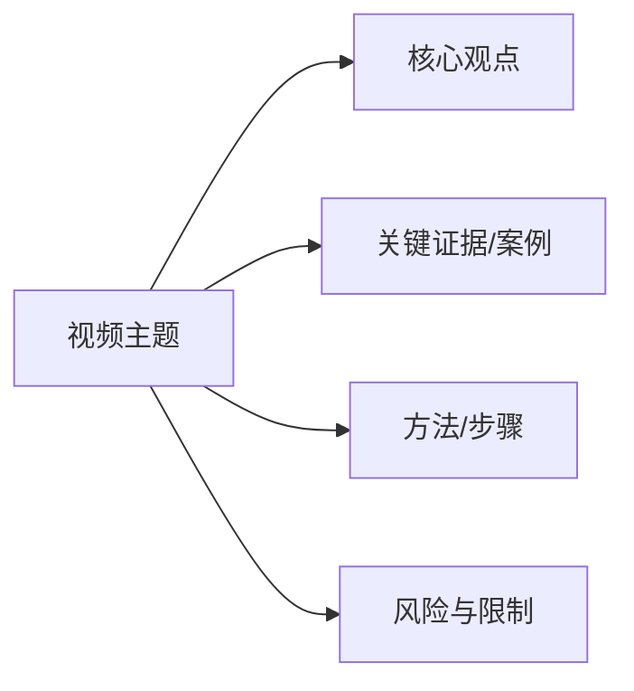

# Video Notes Generator

> Based on [BiliNote v2.4.0](https://github.com/JefferyHcool/BiliNote) by JefferyHcool.
> No external LLM / API Key required. The Agent itself acts as the LLM for note generation.

Converts video content from URLs or local files into structured, readable Markdown notes using AI. Supports multiple video platforms, transcription engines, note styles, and default visual frame extraction for native multimodal image understanding. Final Markdown must start with a horizontal Mermaid mind map and should use Mermaid diagrams wherever they clarify structure, process, timeline, or relationships.

Extracted from **BiliNote v2.4.0** by JefferyHcool. Public skill files intentionally omit local checkout paths and temporary sync directories.

## When to Use

Trigger when the user says any of:
- "视频笔记", "视频总结", "视频转笔记"
- "video notes", "summarize video", "video to notes"
- "generate notes from video", "video summary"
- Shares a Bilibili/YouTube/Douyin/Kuaishou URL and asks for notes/summary
- Asks to transcribe or summarize a local video file

## Quick Start

```bash
# Summarize a Bilibili video
python ~/.hermes/skills/media/video-notes-generator/scripts/video_to_notes.py \
  "https://www.bilibili.com/video/BV1xxxxx"

# Summarize a YouTube video and write outputs to a custom directory
python ~/.hermes/skills/media/video-notes-generator/scripts/video_to_notes.py \
  "https://www.youtube.com/watch?v=xxxxx" -o ./my_notes

# Process a local file. Frames are extracted by default for multimodal analysis.
python ~/.hermes/skills/media/video-notes-generator/scripts/video_to_notes.py \
  "/path/to/video.mp4" --frame-interval 30 --max-frames 3

# Text-only emergency mode only when video download/frame extraction is impossible
python ~/.hermes/skills/media/video-notes-generator/scripts/video_to_notes.py \
  "https://www.bilibili.com/video/BV1xxxxx" --no-frames
```

## Configuration

### Environment Variables (.env or export)

| Variable | Required | Default | Description |
|---|---|---|---|
| `VIDEO_NOTES_RUNTIME_DIR` | No | `~/.cache/video-notes-generator` | Runtime directory for optional `.env`, bins, and downloaded helper assets |
| `VIDEO_NOTES_ENV` | No | `<VIDEO_NOTES_RUNTIME_DIR>/.env` | Optional env file loaded before running |
| `YTDLP` | No | auto-detected `yt-dlp` | Path to yt-dlp executable |
| `FFMPEG` | No | auto-detected `ffmpeg` | Path to ffmpeg executable |
| `TRANSCRIBER_TYPE` | No | `faster-whisper` | Engine selection used by the script when subtitles are unavailable |
| `WHISPER_CPP` | No | auto-detected | Optional whisper.cpp binary path |
| `WHISPER_MODEL` | No | `base` | whisper.cpp model name or faster-whisper alias when transcription is needed. Built-ins include `tiny`, `base`, `small`, `medium`, `large-v1`, `large-v2`, `large-v3`, `large-v3-turbo`. |
| `VIDEO_NOTES_PROXY` | No | standard proxy env fallback | Explicit proxy URL for yt-dlp/subtitle/network calls. If unset, the script falls back to `<runtime>/config/proxy.json` when `enabled=true`, then `HTTPS_PROXY`/`HTTP_PROXY`/`ALL_PROXY`. Mirrors BiliNote v2.4.0 global proxy behavior. |
| `VIDEO_NOTES_PROXY_CONFIG` | No | `<VIDEO_NOTES_RUNTIME_DIR>/config/proxy.json` | Optional proxy JSON path: `{ "enabled": true, "url": "http://127.0.0.1:7890" }`. |
| `VIDEO_NOTES_WHISPER_MODEL_CONFIG` | No | `<VIDEO_NOTES_RUNTIME_DIR>/config/whisper_models.json` | Optional custom faster-whisper model mapping JSON: `{ "my-model": "Org/repo-or-local-path" }`, following BiliNote v2.4.0 configurable model registry. |
| `VIDEO_NOTES_TRANSCRIPT_CHUNK_CHARS` | No | `3200` | Character budget per compact transcript chunk |
| `VIDEO_NOTES_TRANSCRIPT_PREVIEW_CHARS` | No | `1200` | Transcript preview length in final notes |
| `VIDEO_NOTES_MAX_AGENT_FRAMES` | No | `3` | Default maximum extracted frames for agent-safe multimodal analysis |
| `VIDEO_NOTES_FRAME_MAX_WIDTH` | No | `640` | Maximum frame image width after resizing |

### CLI Arguments

| Arg | Description |
|---|---|
| `url` | Required positional argument: video URL (Bilibili, YouTube, Douyin, Kuaishou) or local video file path |
| `-o`, `--output` | Output directory; default `./notes` |
| `--no-subtitle` | Skip subtitle fetching and download/transcribe audio directly |
| `--transcribe` | Force whisper.cpp transcription instead of subtitle-first behavior |
| `--model` | whisper.cpp model name; defaults to `WHISPER_MODEL` or `base` |
| `--frames` | Kept for compatibility; frame extraction is now enabled by default |
| `--no-frames` | Emergency text-only mode. Use only after frame extraction/download failed or the user explicitly forbids images |
| `--frame-interval` | Seconds between extracted frames when interval mode is used; default `30` |
| `--max-frames` | Maximum extracted frames; default `VIDEO_NOTES_MAX_AGENT_FRAMES` (`3` unless overridden) |
| `--print-full-json` | Print full structured JSON to stdout; avoid in Claude Code unless raw JSON is explicitly requested |

Unsupported in this script version: `--url`, `--file`, `--style`, `--format`, and `--quality`. Use the positional `url` argument and let the agent synthesize the final note style from `*_final_notes.md`, `*_chunk_summaries.md`, and optional frames.

## Note Style

This script does not accept a `--style` flag. It produces compact source artifacts (`*_final_notes.md`, `*_chunk_summaries.md`, `*_transcript.json`, and `*_visual_manifest.json` unless `--no-frames` is used). The agent should transform those artifacts into the user-requested style in the conversation or by editing the generated Markdown.

### Mandatory final Markdown structure

Every final video-summary Markdown document must start with a horizontal Mermaid mind map before normal prose. Use `flowchart LR` so the diagram is visibly left-to-right in renderers that support Mermaid:



After the opening mind map, actively add Mermaid diagrams where they improve understanding: `flowchart LR/TD` for processes and causal chains, `timeline` for chronological development, `sequenceDiagram` for interactions, `quadrantChart` for comparisons, `journey` for user/task experience, and `xychart-beta` for numeric trends when data is available. Do not invent data just to draw a chart; diagrams must be grounded in transcript, visuals, or explicitly labeled interpretation.

For videos with visual frames, include a visible screenshot/key-frame section in the Markdown itself. Each embedded image needs timestamp, relative image path, visual observation, nearby transcript, and an explicit source label (`native multimodal`, `OCR fallback`, or `pending visual review`).

## Platform Support

For Bilibili uploader-wide jobs ("summarize all videos from this UP"), see `references/bilibili-uploader-discovery.md` before starting. It documents candidate discovery, per-BV uploader verification with yt-dlp, anti-bot fallbacks, and truthful reporting standards. When the user needs an exact uploader archive rather than candidate discovery, also read `references/bilibili-uploader-exact-space-api.md`; prefer Bilibili-native space/search-index sources plus yt-dlp owner verification over generic web search.

| Platform | Subtitles | Download | Cookies | Notes |
|---|---|---|---|---|
| Bilibili | ✅ Priority | yt-dlp + automatic public API fallback | Recommended for restricted videos | Subtitle-first; if yt-dlp hits HTTP 412, the script now fetches public metadata/playurl, downloads DASH audio/video with browser-like headers, muxes locally, then falls back to whisper |
| YouTube | ✅ Priority | yt-dlp | Optional | Prefers existing subtitles; supports proxy via `VIDEO_NOTES_PROXY` / `config/proxy.json` / standard proxy env, aligned with BiliNote v2.4.0 |
| Douyin | ❌ | yt-dlp + ABogus | Not needed | Anti-bot bypass built-in |
| Kuaishou | ✅ | yt-dlp + helper | Not needed | Custom downloader |
| Local | N/A | Direct file | N/A | Any format FFmpeg supports |

## Native Multimodal Visual Workflow

Frame extraction and Markdown image embedding are **default requirements**, not optional polish. A video summary is incomplete unless one of these is true: (a) representative key frames were extracted, analyzed, and embedded in `*_final_notes.md`; or (b) a verified failure/fallback note explains why visual evidence could not be produced.

Required workflow for every video-summary run:

1. Run the script with frame extraction enabled. This is now the default; pass `--no-frames` only for emergency text-only fallback or when the user explicitly forbids images.
2. Verify `*_visual_manifest.json` exists and contains frame entries. For normal videos, prefer representative timestamps across the video (for example 20%, 50%, 80%) over only the opening seconds.
3. If the active model supports native image input, open each `image_path` directly and analyze the actual frame visually.
4. Fill the summary with visual observations such as scene changes, UI operations, gestures, objects, diagrams, slide structure, chart axes, screen text, and visual evidence that confirms or contradicts nearby transcript.
5. If the active model does **not** support image input, use OCR only as a fallback and clearly mark those notes as OCR-derived rather than native visual understanding.
6. Combine visual observations with `nearby_transcript` and timestamps; do not invent details that are not visible or audible.
7. Ensure `*_final_notes.md` contains Markdown image embeds plus per-frame notes. Do not report completion while `visual_note` fields are blank unless each blank is explicitly labeled `pending visual review` and the user accepted text-only output.

The script writes `*_notes.md` and `*_final_notes.md` as integrated user-facing notes. The script can embed frames and placeholders, but the agent/model is responsible for replacing pending visual notes with real native multimodal observations when image input is available.

### Bulk uploader visual-enrichment rule

For uploader/channel-wide jobs, a transcript-only first pass is not complete when the user requested or the skill implies screenshots/key frames. Every video must be upgraded with frame image embeds and visual notes, and the aggregate summary must be regenerated from the upgraded per-video Markdown. Use `references/bulk-visual-enrichment.md` for the exact workflow: extract bounded representative frames, analyze them with native multimodal vision or clearly labeled OCR fallback, retry transient vision failures per-video, merge image embeds + visual observations into each `*_final_notes.md`, then verify all counts before reporting success.

## Context-Safe Workflow

The script is designed to avoid Claude Code context overflow:

1. Read `*_final_notes.md` first for the user-facing result.
2. Read `*_chunk_summaries.md` before opening `*_transcript.json`.
3. Do not read the full transcript JSON unless the user explicitly asks for raw transcript details.
4. If more detail is needed, inspect one transcript chunk or one timestamp range at a time.
5. Treat `*_visual_manifest.json` as a compact frame index. For video-summary tasks, visual evidence is required by default: open representative frames one at a time and summarize them.
6. Open at most one frame per model request unless using a compact contact sheet. Never send multiple full-size images plus transcript together.
7. If a model/API returns a context-window error, retry from `*_chunk_summaries.md` and `*_final_notes.md`; do not resend raw transcript, OCR, and frames together.

The full transcript remains available in `*_transcript.json`, but it is an archive artifact, not the default prompt input.
The CLI prints a short JSON summary by default. Do not use `--print-full-json` inside Claude Code unless the user explicitly asks for raw JSON output.

## Common Pitfalls

1. **No ffmpeg**: Required system dependency. Install via `apt install ffmpeg` / `brew install ffmpeg` / `choco install ffmpeg`.
2. **No yt-dlp**: Required for URL downloads. Install yt-dlp and optionally set `YTDLP` if it is not on PATH.
3. **Bilibili download fails**: Set Bilibili cookies for restricted videos or videos that require login. For public videos where `yt-dlp` fails with `HTTP 412 Precondition Failed`, the script now automatically uses the Bilibili public API fallback documented in `references/bilibili-412-api-fallback.md`: fetch `x/web-interface/view`, fetch `x/player/playurl`, download DASH audio/video with browser-like headers, mux to a local MP4, then continue transcription and frame extraction. Treat Windows SSL EOF/certificate failures as a fallback path, not the default workflow: retry with native `curl -L -k` or `yt-dlp.exe --no-check-certificate`; avoid relying on a `.cmd` wrapper as `YTDLP` when Python subprocesses also pass Unicode output paths.
4. **YouTube subtitle/download missing**: Falls back to audio transcription when subtitles are unavailable. For restricted networks, configure `VIDEO_NOTES_PROXY` or `<runtime>/config/proxy.json` before retrying; this mirrors BiliNote v2.4.0's global proxy behavior.
5. **Frames missing**: Frames should be extracted by default. If `frame_count=0`, do not silently continue; retry video download/frame extraction, then use `--no-frames` only as a clearly reported fallback.
6. **Long video (>2h)**: Automatically chunked and merged, but may take significant time.
7. **Chinese output only**: The generated artifacts are Chinese-oriented; transform the final response manually if the user asks for another language/style.
8. **Old parameters fail**: This script version does not support `--url`, `--file`, `--style`, `--format`, or `--quality`; pass the URL/local file as the positional `url` argument.
9. **Custom faster-whisper models**: BiliNote v2.4.0 added a model registry. In this zero-pip skill script, add mappings to `<runtime>/config/whisper_models.json` or set `VIDEO_NOTES_WHISPER_MODEL_CONFIG`; built-in aliases include `large-v3` and `large-v3-turbo`.
10. **Browser zombie processes on Windows**: When the Agent uses `browser_navigate` / `browser_click` / `browser_snapshot` / `browser_vision` to inspect a video page (for example, to verify a Bilibili URL before running the script), the underlying Chrome/Chromium automation may leave `agent-browser-chrome-*` temporary profile processes alive if the browser tool crashes or exits uncleanly. These accumulate over time and can consume several GB of RAM. The script itself does NOT launch any browser; the zombies come from the Agent's browser tool, not from `video_to_notes.py`. If you see many `chrome.exe` processes with `--user-data-dir=...\agent-browser-chrome-...`, kill them with `taskkill /F /T /PID <root_pid>` (Windows) or `pkill -f 'agent-browser-chrome'` (Linux/macOS). The script now includes automatic cleanup of known agent-browser-chrome roots at startup to mitigate this.

## Verification Checklist

After running, verify:
- [ ] Output `.md` integrated notes file exists in the selected output directory
- [ ] Final Markdown starts with a horizontal Mermaid mind map (`flowchart LR`) before the normal prose
- [ ] Mermaid diagrams are added in relevant sections when they clarify process, timeline, hierarchy, comparison, or relationships
- [ ] Output `.json` transcript file exists for programmatic reuse
- [ ] Output `*_chunk_summaries.md` exists and is read before full transcript JSON
- [ ] Output `*_final_notes.md` exists for user-facing notes
- [ ] Markdown renders correctly (no broken formatting)
- [ ] Frame timestamp sections and Markdown image embeds are present unless `--no-frames` fallback was explicitly used
- [ ] Frames directory contains images for normal video runs
- [ ] `*_visual_manifest.json` points to existing image files for normal video runs
- [ ] No more than one frame is passed into any single model request unless the user explicitly asks for deeper visual inspection
- [ ] Native multimodal visual notes are used when image input is supported; OCR fallback is marked if used
- [ ] No error messages in terminal output
